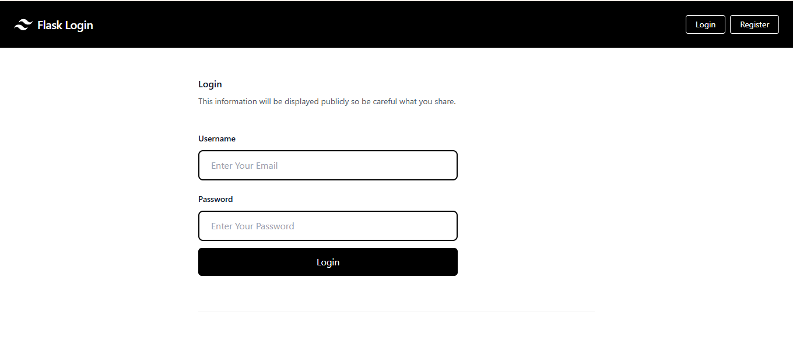

# Flask Authentication Application 


- React + vite +Typescript 
- Proper form validation
- !Responsive UI
- Using Axios for Api Calling
- Using Context Api to Managing State
- Flask + Mysql 


## for backend

```bash 
        python -m venv venv # create virtual env
        venv/Scripts/activate # activate virtual env
        pip install -r requirement.txt # install dependencies
        python app.py ## start python app
```

## for frontend
`.env.local`
```bash
VITE_APP_BACKEND_URI=http://localhost:5000 
```

[demo](https://coderkrishna.pythonanywhere.com/)

